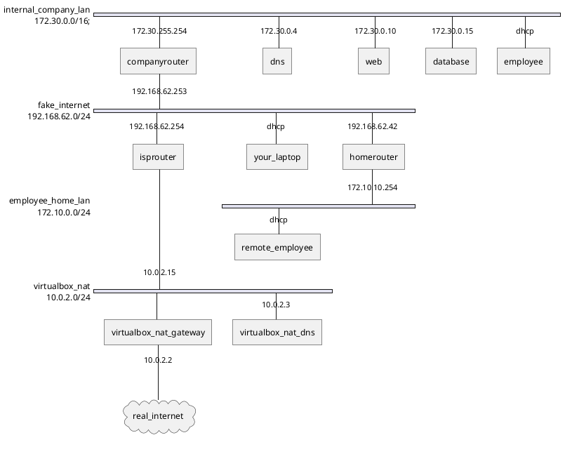

# Cybersecurity-advanced-lab-template

This environment is used to build up the lab set-up. It provides the base network and hosts. The entire network is built up in VirtualBox, using Vagrant.

## Network design

The network consists of 4 subnets:

-   172.30.0.0/16: **internal company LAN**.
-   192.168.62.254/24: **fake internet**.
-   172.10.10.0/24: **employee home LAN**.
-   10.0.2.0/24: **VirtualBox NAT network**.

:bulb: Tip: Linux and Mac users must first read https://www.virtualbox.org/manual/ch06.html#network_hostonly .

> On Linux, macOS and Solaris Oracle VM VirtualBox will only allow IP addresses in 192.168.56.0/21 range to be assigned to host-only adapters. For IPv6 only link-local addresses are allowed. If other ranges are desired, they can be enabled by creating /etc/vbox/networks.conf and specifying allowed ranges there. For example, to allow 10.0.0.0/8 and 192.168.0.0/16 IPv4 ranges as well as 2001::/64 range put the following lines into /etc/vbox/networks.conf:
>
> -   10.0.0.0/8 192.168.0.0/16
> -   2001::/64



## Usage

1. Create the following host-only network in VirtualBox to simulate the the fake internet:

    - Name: `vboxnet1` (when different, for example on Windows: "VirtualBox Host-Only Ethernet Adapter #2", change this in the `Vagrantfile`)
    - IP range: 192.168.62.0/24

2. `vagrant up --parallel` or go slowly (1 by 1) and do `vagrant up <machinename>` 

3. Disable all the NAT connections added by vagrant: `./disable-nat.sh` or use `./disable-nat.ps1` (if you receive an error about running scripts being disable, make sure you understand what this is. A quick alternative is to copy over the contents in PowerShell ISE or in an interactive PowerShell window).

    :warning: `vagrant ssh` won't work anymore and that is **by design**! This command is also not available in a real network, so learn to use SSH properly: login into the required hosts using SSH with IP addresses and jump/forward options!

4. Test connectivity with Ansible (Ansible cannot be installed on Windows, if your host is running Windows you can install Ansible in WSL. Another alternative is to copy over the repository to the companyrouter and install Ansible. Instructions can be found [here for WSL](./installation-windows-wsl.md) and [here without WSL](./installation-windows-no-wsl.md)):

    ```console
    $ ansible fake_internet --inventory ansible/inventory.yml --module-name ping
    red | SUCCESS => {
        "ansible_facts": {
            "discovered_interpreter_python": "/usr/bin/python3"
        },
        "changed": false,
        "ping": "pong"
    }
    [WARNING]: Platform linux on host isprouter is using the discovered Python interpreter at /usr/bin/python3.11, but future installation of another Python
    interpreter could change the meaning of that path. See https://docs.ansible.com/ansible-core/2.16/reference_appendices/interpreter_discovery.html for more
    information.
    isprouter | SUCCESS => {
        "ansible_facts": {
            "discovered_interpreter_python": "/usr/bin/python3.11"
        },
        "changed": false,
        "ping": "pong"
    }
    homerouter | SUCCESS => {
        "ansible_facts": {
            "discovered_interpreter_python": "/usr/bin/python3"
        },
        "changed": false,
        "ping": "pong"
    }
    companyrouter | SUCCESS => {
        "ansible_facts": {
            "discovered_interpreter_python": "/usr/bin/python3"
        },
        "changed": false,
        "ping": "pong"
    }
    ```

5. Run the playbook with Ansible:

    ```console
    ansible-playbook --inventory ansible/inventory.yml ansible/playbook.yml 

    PLAY [Configure routing on ISP router] ***

    TASK [Gathering Facts] *******************
    [WARNING]: Platform linux on host isprouter is using the discovered Python interpreter at /usr/bin/python3.11, but future installation of another Python interpreter could change the meaning of that path. See https://docs.ansible.com/ansible-core/2.16/reference_appendices/interpreter_discovery.html for more
    information.
    ok: [isprouter]

    TASK [Enable routing] ******************************************************
    changed: [isprouter]

    TASK [Install firewall] ****************************************************
    changed: [isprouter]

    TASK [Copy firewall configuration] *****************************************
    changed: [isprouter]

    TASK [Enable and start firewall] *******************************************
    changed: [isprouter]

    PLAY [Configure routing on company router] *********************************

    TASK [Gathering Facts] *****************************************************
    ok: [companyrouter]

    TASK [Enable routing] ******************************************************
    changed: [companyrouter]

    PLAY RECAP *****************************************************************
    companyrouter              : ok=2    changed=1    unreachable=0    failed=0    skipped=0    rescued=0    ignored=0   
    isprouter                  : ok=5    changed=4    unreachable=0    failed=0    skipped=0    rescued=0    ignored=0  
    ```
