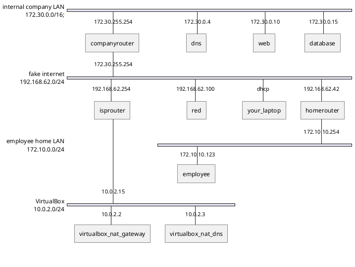

# CyberCSA-lab-template

This environment is used to build up the lab set-up. It provides the base network and hosts. The entire network is built up in VirtualBox, using Vagrant.

## Network design

The network consists of 4 subnets:

-   172.30.0.0/16: **internal company LAN**.
-   192.168.62.254/24: **fake internet**.
-   172.10.0.0/24: **employee home LAN**.
-   10.0.2.0/24: **VirtualBox NAT network**.

:bulb: Tip: Linux and Mac users must first read https://www.virtualbox.org/manual/ch06.html#network_hostonly .

> On Linux, macOS and Solaris Oracle VM VirtualBox will only allow IP addresses in 192.168.56.0/21 range to be assigned to host-only adapters. For IPv6 only link-local addresses are allowed. If other ranges are desired, they can be enabled by creating /etc/vbox/networks.conf and specifying allowed ranges there. For example, to allow 10.0.0.0/8 and 192.168.0.0/16 IPv4 ranges as well as 2001::/64 range put the following lines into /etc/vbox/networks.conf:
>
> -   10.0.0.0/8 192.168.0.0/16
> -   2001::/64

## Usage

1. Create the following host-only network in VirtualBox to simulate the the fake internet:

    -   Name: `vboxnet1` (when different, change this in `Vagrantfile`)
    -   IP range: 192.168.62.0/24

2. `vagrant up --parallel`
