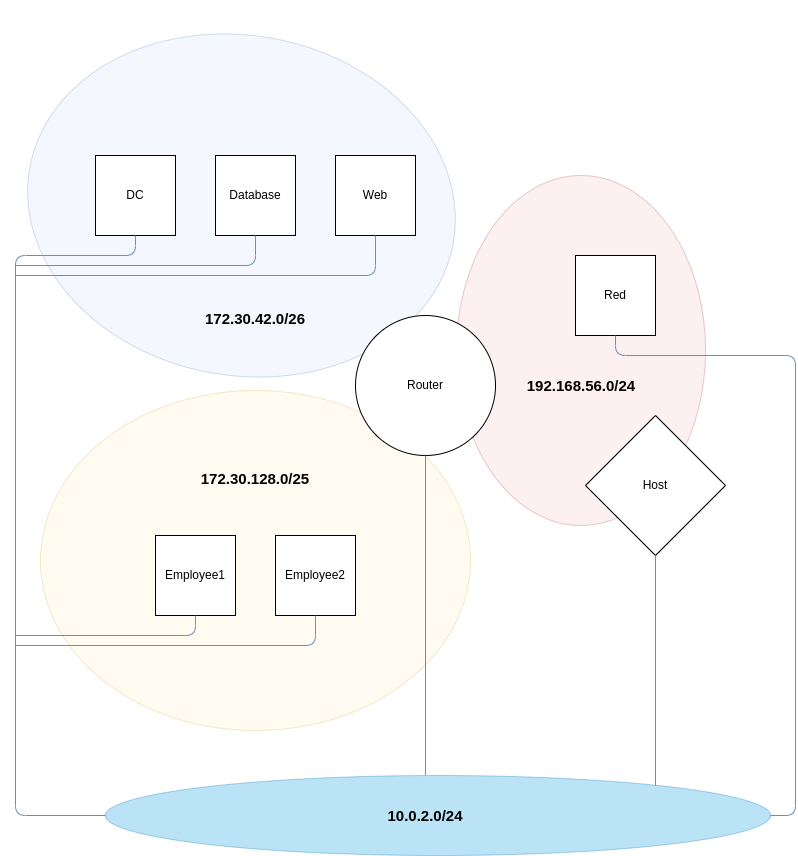

# CyberCSA-lab-template
Cyberysecurity Advanced - lab environment template

This environment is used by the involved lecturers in the course to build up the lab set-up using ansible. 
It provides the base netwerk + hosts; tweaking is done manually after this step.

## Network design
The entire network is built up in VirtualBox, using Vagrant.

### Management network
All nodes have a eth0, connecting them via NAT to the Internet. Range: 10.0.2.0/24.

### Production network
The network consists of 2 company-LANs, attached to a router:
* a LAN network for the Servers: 172.30.42.0/26
    * Network address         - 172.30.42.0
    * Network mask            - 255.255.255.192
    * Network mask (bits)     - 26
    * Broadcast address       - 172.30.42.63
    * Addresses in network    - 64
    * Network range           - 172.30.42.0 - 172.30.42.63
    * Usable range            - 172.30.42.1 - 172.30.42.62
* a LAN network for the employees - 172.30.128.0/25: DHCP + DNS for these networks is provided by the router.
    * Network address         - 172.30.128.0
    * Network mask            - 255.255.255.128
    * Network mask (bits)     - 25
    * Broadcast address       - 172.30.128.127
    * Addresses in network    - 128
    * Network range           - 172.30.128.0 - 172.30.128.127
    * Usable range            - 172.30.128.1 - 172.30.128.126

The router itself also has an uplink to the Host OS. It is considered as the WAN entry point of the company network. This host-only network can also be used to connect a Kali VM to attack the company premises. DHCP is coming from VirtualBox for this network.
* WAN network: 10.0.2.0/24
    * Network address         - 10.0.2.0
    * Network mask            - 255.255.255.0
    * Network mask (bits)     - 24
    * Broadcast address       - 10.0.2.255
    * Addresses in network    - 256
    * Network range           - 10.0.2.0 - 10.0.2.255
    * Usable range            - 10.0.2.1 - 10.0.2.254

## Machines overview

Name      | Network   | IP                | prefixlength  | default gateway | Remarks
--------- | --------- | ----------------- | ------------- | --------------- | ---
router    | outside   | DHCP              | 24            | ???             | Router of the environment
router    | servers   | 172.30.42.1       | 26            | ???             | ^
router    | employees | 172.30.128.1      | 25            | ???             | ^
web       | servers   | 172.30.42.2       | 26            | 172.30.42.1     | Webserver
database  | servers   | 172.30.42.3       | 26            | 172.30.42.1     | Lightweight MySQL Database
employee1 | employees | DHCP              | 25            | 172.30.128.1    | Ubuntu
red       | employees | DHCP              | 25            | 172.30.128.1    | Kali outside the network
dc        | servers   | 172.30.42.4       | 26            | 172.30.42.1     | Windows AD server core with domain
employee2 | employees | DHCP              | 25            | 172.30.128.1    | Windows 10 client (domain joined) 

## Users
* Thomas Clauwaert
* Martijn Saelens
* Andy Van Maele
