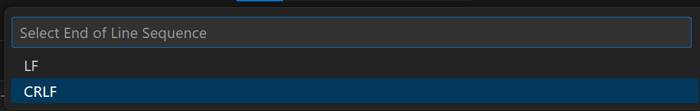

# Installation on Windows host using WSL

This solution should work on both WSL version 1 and version 2. You can check your version with `wsl -l -v`. The default distro used with WSL is Ubuntu. You can install ansible using `sudo apt install ansible`. This will be a pretty old version of ansible but should work for our needs.

All instructions from the Linux installation are pretty much valid, but there is one big caveat (see below). You browse to the git repository on you windows location path, probably something like `/mnt/c/Users/<username>/.../cybersecurity-advanced-lab-template`. Tip: you can easily navigate using a PowerShell or cmd window and type `wsl`. That way you don't have to cd. 

# Caveat

We use ansible to configure the virtual machines and copy over some files. For people who do not know this, Windows and Linux treat the "newline" differently. In other words the "End of Line Sequence" is different. Linux uses what is called LF (line feed) or `'\n'` where as Windows uses CR+LF (often reffered to as CRLF) or `'\r\n'`. If you are interested to learn more refer to <https://en.wikipedia.org/wiki/Newline>

This means that since we have the source files present on a Windows device in the `ansible/files` folder, all the configuration files that Ansible on (Ubuntu) WSL will copy over will have CRLF line endings on the Linux virtual machines. Depending on how certain software was programmed this might throw errors and it's best to avoid this. The easiest fix is to open the entire repository in visual studio code and open the files. At the bottom of visual studio code you should see CRLF. Pressing this will open a drop down window at the top, where you can switch to LF. After saving, the file will now have LF file endings. If you will now issue the `ansible-playbook` command, things should be completely similar to the linux install instructions.

At the bottom of visual studio code:
 

At the top after pressing it:
 

`ansible fake_internet --inventory ansible/inventory.yml --module-name ping`

`ansible-playbook --inventory ansible/inventory.yml ansible/playbook.yml`

Finally, to reach the internal network you will have to add a route on your host (!) 

`route add 172.30.0.0 mask 255.255.0.0 192.168.62.254`

:warning: Be very mindful. If this range would overlap with another network (docker, at home...)!